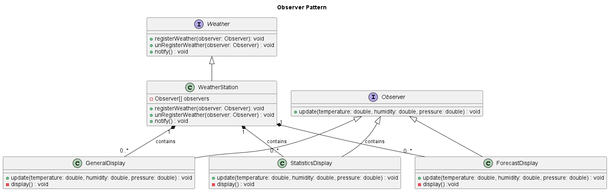

# Observer Pattern
Observer pattern defines a one-to-many dependency between objects so that when the state of the one object changes, then all its dependents are notified and updated automatically.

